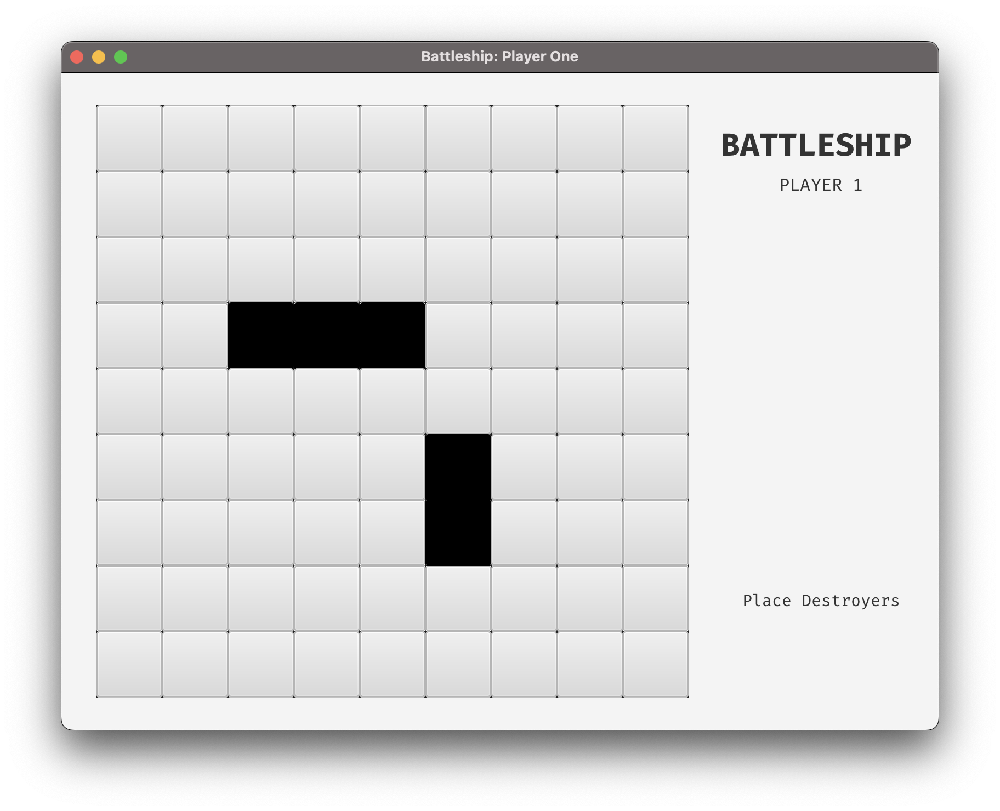
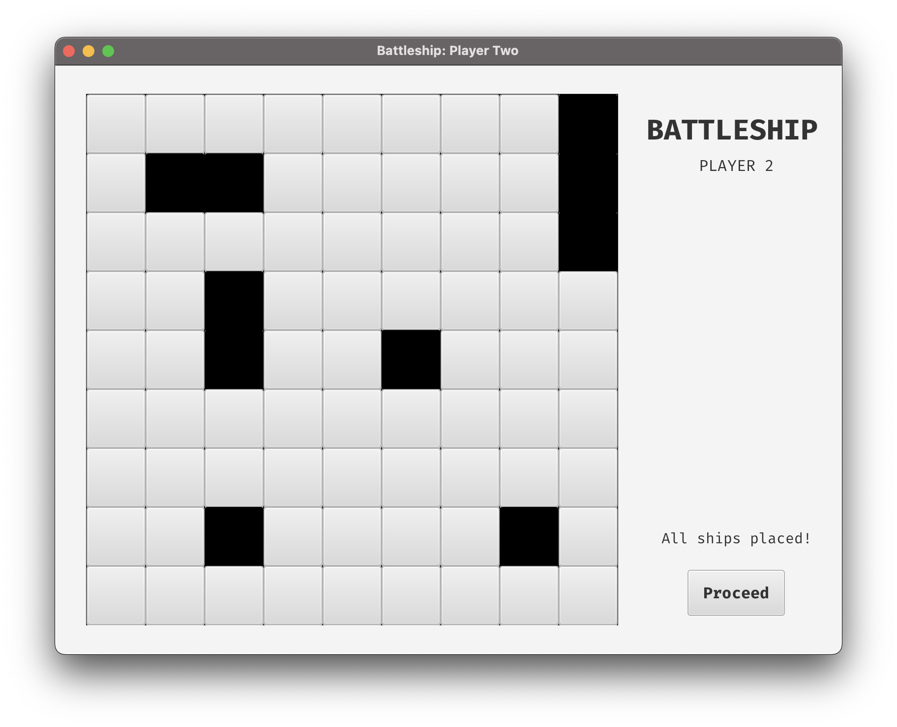
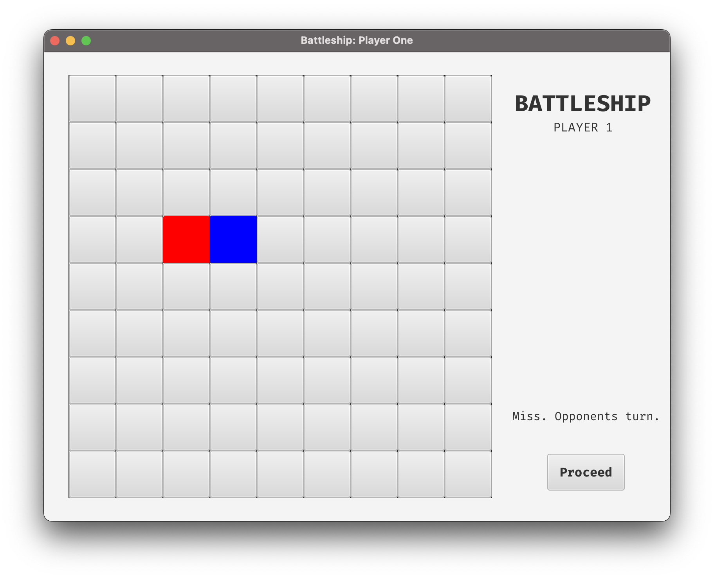

# Battleship

This is a simple implementation of the classic Battleship game using JavaFX, Maven, and Scenebuilder. 

## Features
- Player vs player gameplay
- Interactive GUI built with JavaFX and Scenebuilder
- Accurate tracking of hits and misses

## How to play
- Launch the game by running the Main.java file.
- Each player has:
  - 1 Battleship (Occupies 3 squares)
  - 2 Destroyers (Occupies 2 squares each)
  - 3 Submarines (Occupies 1 square each)
- Player 1 places their ships first then player 2 follows.
- When placing ships follow the prompt at the down-right corner of the screen. To place a ship click the starting square of the ship first then the ending square. Placed ships will be marked in black and their position cannot be changed once placed.
- After both players are done placing ships, the game commences.
- Each player takes turn trying to hit the opponent's ship. If hit, the player gets another turn and the square turns red. If missed, the turn ends, the square turns blue and it's the opponent player's turn.
- The game ends when one player sinks all of the opponent's ships.

## Screenshots

